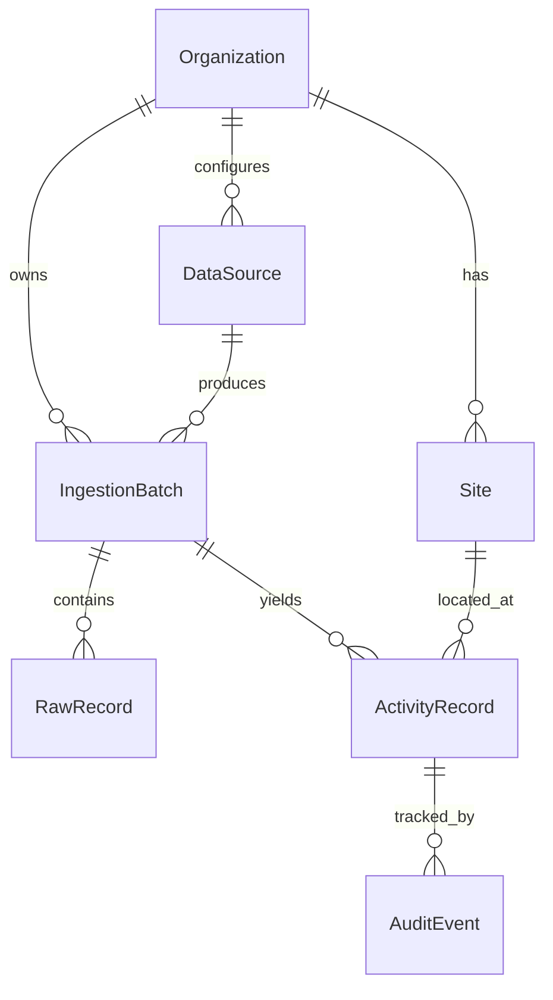

# ESG Activity Ingestion — Data Model

## Overview

The prototype uses a **multi-tenant canonical activity model**. Every ingested row from SAP, utility, or travel sources is stored as raw JSON, normalized into `ActivityRecord`, and tracked through an analyst review workflow with full audit history.

## Entity relationship



## Core entities

### Organization

Multi-tenant root. All queries are scoped by `organization_id` via authenticated user membership.

### Site

Maps external plant/account codes (`WERKS`, utility account numbers) to human-readable locations. Used for site assignment and unknown-site flagging.

### DataSource

Configured ingest profile per organization: SAP ME2N, SAP MB51, utility portal CSV, or travel segments.

### IngestionBatch

One file upload run. Tracks `total_rows`, `success_count`, `error_count`, `flagged_count`, and parse error summary.

### RawRecord

Immutable original row payload as JSON. Parse failures stay here with `parse_status=error`.

### ActivityRecord

Canonical normalized activity row — the primary table for analyst review and audit lock.

| Field                                     | Purpose                                                                  |
| ----------------------------------------- | ------------------------------------------------------------------------ |
| `scope`                                   | scope_1, scope_2, scope_3                                                |
| `category`                                | fuel_combustion, purchased_electricity, purchased_goods, business_travel |
| `review_status`                           | pending → flagged/approved → locked                                      |
| `quantity_raw` / `unit_raw`               | As received from source                                                  |
| `quantity_normalized` / `unit_normalized` | Canonical units                                                          |
| `source_row_id`                           | Stable ID from source (PO line, bill period, segment ID)                 |
| `source_metadata`                         | Source-specific fields (movement type, tariff, IATA codes)               |
| `flag_reasons`                            | Plain-language suspicious row heuristics                                 |
| `is_locked`                               | True after analyst approval for audit                                    |

### AuditEvent

Append-only log: created, flagged, approved, rejected, locked, unlocked. Stores `before_state` and `after_state` JSON snapshots.

## Scope mapping rules

| Source          | Scope   | Category              | Notes                                  |
| --------------- | ------- | --------------------- | -------------------------------------- |
| SAP MB51 fuel   | Scope 1 | fuel_combustion       | Direct combustion activity             |
| Utility kWh     | Scope 2 | purchased_electricity | Location-based placeholder             |
| SAP ME2N spend  | Scope 3 | purchased_goods       | Spend-based proxy; flagged in metadata |
| Travel segments | Scope 3 | business_travel       | GHG Protocol Cat. 6                    |

## Unit normalization

| Raw unit  | Normalized | Conversion  |
| --------- | ---------- | ----------- |
| L, LTR    | L          | 1:1         |
| KG        | kg         | 1:1         |
| TO, TON   | t          | stored as t |
| KWH       | kWh        | 1:1         |
| MWH       | kWh        | ×1000       |
| MI, MILES | km         | ×1.60934    |
| nights    | nights     | 1:1         |

Both raw and normalized values are stored for audit defensibility.

## Review workflow

```
pending → flagged (heuristics) → approved → locked
                ↓
             rejected
```

Parse failures never create `ActivityRecord` — they remain on `RawRecord` with error messages.

## Tenancy enforcement

- `User.organization` FK determines tenant
- `TenantMiddleware` sets `request.organization`
- All API querysets filter by `organization= request.organization`
