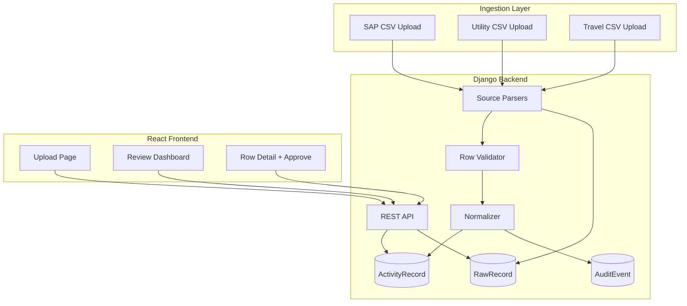
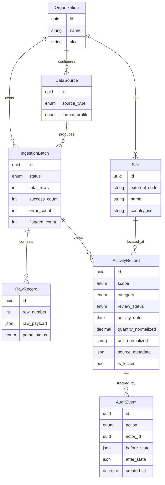

# ESG Activity Ingestion Prototype — Full 4-Day Build Plan

**Tech intern assignment**  
**Stack:** Django REST + React  
**Timeline:** 4 days  
**Deployment:** Mandatory (Render recommended)

---

## Table of contents

1. [Project context](#project-context)
2. [Strategic thesis](#strategic-thesis)
3. [What to build](#what-to-build)
4. [Architecture](#architecture)
5. [Repository layout](#repository-layout)
6. [Source ingestion decisions](#source-ingestion-decisions)
7. [Data model](#data-model)
8. [Backend implementation](#backend-implementation)
9. [Frontend implementation](#frontend-implementation)
10. [Documentation deliverables](#documentation-deliverables)
11. [Deployment checklist](#deployment-checklist)
12. [4-day schedule](#4-day-schedule)
13. [Implementation todos](#implementation-todos)
14. [Testing strategy](#testing-strategy)
15. [Grading alignment](#grading-alignment)
16. [Risk mitigations](#risk-mitigations)
17. [Submission checklist](#submission-checklist)

---

## Project context

This system ingests emissions and activity data from client companies. The hard part is not computing carbon — it is that every client's data lives somewhere different, in a different shape, with different gaps:

- SAP exports for fuel and procurement
- Utility bills as PDFs or portal scrapes
- Travel data from Concur or similar
- Spreadsheets a sustainability lead maintains by hand

**PM request:** Onboard a new enterprise client with fuel/procurement in SAP, electricity from utility portals, and business travel from a corporate travel platform. Ingest all of it, normalize it, and let analysts review and sign off before data goes to auditors.

**Quality bar:** Submit less, but submit work you understand and can defend. A smaller app with a sharp data model and honest tradeoffs beats a feature-rich app you cannot explain.

---

## Strategic thesis

Graders weight **data model (35%)** and **decision defense (25%)** over feature count.

Build a **smaller, sharp system** you can explain:

- Three CSV ingestors mapped to real-world export shapes
- One canonical `ActivityRecord` table
- Explicit provenance and audit trail
- A review workflow an analyst can use without reading code

**Default deployment:** [Render](https://render.com) — one Web Service (Django + Gunicorn) serving the React production build as static files + PostgreSQL add-on. Simplest path to a live URL in 4 days; avoids CORS/networking complexity of split services.

**Default scope:** Focused core + light enrichment (IATA great-circle distance fallback, unit normalization, suspicious-row heuristics). No live OAuth APIs, no PDF OCR, no Celery.

---

## What to build

A Django REST and React app that:

1. Ingests data from **three source types** (SAP, utility electricity, corporate travel)
2. **Normalizes** it into a canonical activity model
3. Surfaces a **review dashboard** where an analyst can see:
   - What came in
   - What failed
   - What looks suspicious
   - Approve rows before they are locked for audit

### The three sources

| # | Source | Real-world challenge |
|---|--------|----------------------|
| 1 | **SAP** — fuel and procurement | Inconsistent units, plant codes needing lookup, German headers, odd date formats |
| 2 | **Utility** — electricity | Portal CSV, PDF, or API; meter readings, tariffs, billing periods not aligned to calendar months |
| 3 | **Corporate travel** | Flights, hotels, ground transport; airport codes vs distances; different emission factors per category |

For each source: decide ingestion mechanism (file upload, API pull, manual paste), justify it, research real formats, fabricate realistic sample data.

---

## Architecture



### Data flow

```
Upload → create IngestionBatch(status=processing)
  → for each row: RawRecord + parse
  → valid rows → normalize → ActivityRecord(review_status=pending)
  → apply heuristics → maybe flagged
  → update batch counts → status=ready_for_review
```

Process in chunks (~500 rows) inside one DB transaction with savepoints per row so one bad row does not kill the batch.

---

## Repository layout

```
Paroject/
├── backend/
│   ├── config/           # Django settings, urls
│   ├── core/             # Tenant, Site, User extensions
│   ├── ingestion/        # Parsers, validators, normalizers
│   ├── activities/       # ActivityRecord, Review, Audit models + API
│   └── manage.py
├── frontend/
│   ├── src/
│   │   ├── pages/        # Upload, Dashboard, ReviewDetail
│   │   ├── components/   # StatusBadge, DataTable, FileDropzone
│   │   └── api/          # axios client
│   └── vite.config.ts
├── sample_data/          # Realistic fixtures + README per source
├── docs/
│   ├── PLAN.md           # This document
│   ├── MODEL.md
│   ├── DECISIONS.md
│   ├── TRADEOFFS.md
│   └── SOURCES.md
├── docker-compose.yml    # Local PostgreSQL
├── render.yaml           # Infrastructure as code
├── requirements.txt
└── README.md             # Setup, deploy URL, demo credentials
```

---

## Source ingestion decisions

Research-backed choices for the prototype:

| Source | Real-world format researched | Prototype mechanism | Subset handled | Deliberately ignored |
|--------|------------------------------|---------------------|----------------|----------------------|
| **SAP fuel + procurement** | ME2N (PO/spend) + MB51 (goods movement) ALV→Excel/CSV exports | **File upload** (`.csv`, optional `.xlsx`) | Two profiles: `procurement_spend`, `fuel_activity`; fields: `WERKS`, `BUKRS`, `MATNR`, `MENGE`/`MEINS`, `BUDAT`/`BEDAT`, `KOSTL` | IDoc, OData, IS-U utility billing, invoice accruals, multi-currency FX |
| **Utility electricity** | PG&E/SCE-style portal monthly CSV (billing period + kWh) | **File upload** | Account #, bill period start/end, total kWh, optional rate schedule, meter ID | PDF bill OCR, Green Button OAuth, 15-min interval data, demand kW |
| **Corporate travel** | Concur Itinerary v4 segment shape + Navan bookings export | **File upload** | Air/hotel/car/ground/mileage segments; IATA codes; vendor `Miles` when present | Live Concur OAuth, expense↔itinerary join, radiative forcing |

**Why file upload for all three:** Sustainability teams receive exports from IT/facilities, not raw APIs. Proves normalization + review UX without 1–2 days of OAuth plumbing. Document API path as Phase 2 in `DECISIONS.md`.

### SAP detail (ME2N + MB51)

**Procurement spend (ME2N-style)** — Scope 3 Cat 1 proxy:

| Concept | SAP fields | Example |
|---------|------------|---------|
| PO / line | `EBELN`, `EBELP` | `4500123456`, `00010` |
| Company / plant | `BUKRS`, `WERKS` | `1000`, `DE01` |
| Material | `MATNR`, `TXZ01`, `MATKL` | Diesel EN590, `FUEL` |
| Quantity / UoM | `MENGE`, `MEINS` | `12500.000`, `L` |
| Value | `NETWR`, `WAERS` | `18750.00`, `EUR` |
| Dates | `BEDAT`, `EINDT` | `20250315` |

**Fuel activity (MB51-style)** — Scope 1:

| Concept | SAP fields | Example |
|---------|------------|---------|
| Document | `MBLNR`, `MJAHR`, `ZEILE` | goods movement line |
| Plant | `WERKS`, `LGORT` | `1000`, `FUEL` |
| Movement | `BWART` | `201` (goods issue) |
| Quantity | `MENGE`, `MEINS` | `8500`, `L` |
| Posting date | `BUDAT` | `20250331` |

### Utility detail (portal CSV)

Typical monthly export columns:

```
Account Number, Service Address, Bill Period Start, Bill Period End, Days, kWh Used, Total Charges, Rate Schedule, Meter ID
```

Billing periods often span mid-month to mid-month (e.g. Dec 7 – Jan 6), not calendar months.

### Travel detail (Concur / Navan segments)

Canonical segment fields:

```
source_system, source_record_id, trip_id, traveler_email, mode, origin_iata, destination_iata,
distance_km, distance_source, cabin_class, hotel_nights, passenger_count, booking_status
```

Distance sources: vendor `Miles` field, or great-circle fallback from IATA pair.

---

## Data model

Document fully in `docs/MODEL.md`. Entity relationship:



### Key design rules

1. **Multi-tenancy:** Every query scoped by `organization_id`. Django middleware sets tenant from authenticated user. No cross-tenant FK leaks.

2. **Scope 1/2/3 categorization:**
   - SAP MB51 fuel → **Scope 1** (direct combustion)
   - Utility kWh → **Scope 2** (purchased electricity, location-based placeholder)
   - SAP ME2N spend → **Scope 3 Cat 1** (purchased goods — spend proxy, flagged as such)
   - Travel air/hotel/ground → **Scope 3 Cat 6**

3. **Source-of-truth tracking:** Each `ActivityRecord` stores:
   - `data_source_id`, `ingestion_batch_id`, `raw_record_id`
   - `source_row_id` (e.g. `4500123456-00010`, Concur segment ID)
   - `source_system` enum
   - `ingested_at`, `normalized_at`

4. **Unit normalization:** Canonical units — fuel→liters/kg, energy→kWh, distance→km. Store both raw and normalized quantities with conversion metadata.

5. **Audit trail:** `AuditEvent` on create, edit, approve, lock. Approved rows set `is_locked=True`; edits after approval require explicit unlock action (logged). Store `before_state`/`after_state` JSON snapshots.

6. **Review workflow states:** `pending` → `flagged` | `approved` → `locked`. Parse failures stay on `RawRecord` with `parse_status=error`; suspicious rows get `review_status=flagged` + `flag_reasons[]`.

### Suspicious-row heuristics (analyst UX, not ML)

- Quantity zero with non-zero spend (or vice versa)
- Unknown plant/site code (no lookup match)
- Bill period > 45 days or overlapping duplicate account+period
- Travel: missing distance AND unresolvable IATA pair
- SAP: duplicate `source_row_id` in batch
- Unit not in whitelist

---

## Backend implementation

### Stack

- Django 5.x + Django REST Framework
- PostgreSQL (Render add-on locally via Docker Compose)
- `django-filter`, `drf-spectacular` (optional OpenAPI)
- stdlib `csv` for parsing (`pandas` only if Excel support needed)
- `python-dateutil` for date chaos (SAP `YYYYMMDD`, EU `DD.MM.YYYY`, US `M/D/YYYY`)

### Django apps

| App | Responsibility |
|-----|------------------|
| `core` | `Organization`, `Site`, custom user, tenant middleware |
| `ingestion` | Upload endpoint, batch processing, three parsers + normalizers |
| `activities` | `ActivityRecord`, review actions, audit, dashboard stats API |

### API endpoints

```
POST   /api/v1/batches/upload/           # multipart: file + source_type
GET    /api/v1/batches/                  # list batches with counts
GET    /api/v1/batches/{id}/             # batch detail + error summary
GET    /api/v1/activities/               # filter: status, scope, source, date, flagged
GET    /api/v1/activities/{id}/          # normalized + raw + audit history
PATCH  /api/v1/activities/{id}/review/   # approve | flag | reject
POST   /api/v1/activities/bulk-approve/  # analyst batch sign-off
GET    /api/v1/dashboard/summary/        # KPIs for analyst home
POST   /api/v1/auth/login/               # session login for demo
POST   /api/v1/auth/logout/
GET    /api/v1/auth/me/
```

### Sample data files

Create in `sample_data/`:

| File | Purpose |
|------|---------|
| `sap_procurement_me2n.csv` | Mixed EN/DE headers; tests header mapping |
| `sap_fuel_mb51.csv` | Movement types 201/261; liters + kg units |
| `utility_pge_monthly.csv` | Account, bill period, kWh, rate schedule `E-19` |
| `travel_concur_segments.csv` | Air legs with IATA, hotel, mileage without IATA |

Include one intentionally messy row per source (wrong date format, stripped leading zeros on plant code).

---

## Frontend implementation

### Stack

- React 18 + Vite + TypeScript
- TanStack Query for API state
- Tailwind CSS
- React Router

### Pages (analyst-first UX)

| Route | Page | Features |
|-------|------|----------|
| `/login` | Login | Pre-seeded analyst + admin users |
| `/` | Dashboard | KPI cards, recent batches, source/date filters |
| `/upload` | Upload | Source type selector, drag-drop CSV, validation feedback |
| `/review` | Review queue | Tabs: All / Pending / Flagged / Failed / Approved; bulk approve |
| `/review/:id` | Row detail | Raw vs normalized side-by-side, flag reasons, audit timeline |

**UX principles:** Plain labels ("Electricity — Scope 2", not internal enums). Color-coded status. No empty CRUD screens.

### Production build integration

Vite builds to `frontend/dist/`. Django `collectstatic` + `TemplateView` serves `index.html` for SPA routes.

```bash
cd frontend && npm ci && npm run build
cd ../backend && pip install -r requirements.txt
python manage.py collectstatic --noinput && python manage.py migrate
gunicorn config.wsgi:application
```

---

## Documentation deliverables

| File | Contents |
|------|----------|
| `docs/MODEL.md` | ER diagram, field glossary, tenancy scoping, scope mapping rules, audit semantics, unit normalization table |
| `docs/DECISIONS.md` | SAP=ME2N/MB51 CSV not OData; utility=portal CSV not PDF; travel=itinerary segments not expense reports; sync not async; PM questions (plant master data owner? fiscal vs calendar period? approval granularity?) |
| `docs/TRADEOFFS.md` | Three explicit non-builds: (1) live API integrations, (2) PDF/OCR utility ingestion, (3) full emission factor engine |
| `docs/SOURCES.md` | Per source: researched formats, sample column rationale, what breaks at scale |

Reference standards: GHG Protocol Scope 3 Cat 6, Green Button ESPI, SAP ME2N/MB51 field names, Concur Itinerary v4 segment fields.

---

## Deployment checklist

1. Source repository (private OK)
2. Render Web Service + PostgreSQL
3. Environment variables:
   - `DATABASE_URL`
   - `SECRET_KEY`
   - `ALLOWED_HOSTS`
   - `DJANGO_DEBUG=false`
4. `render.yaml` for reproducible deploy
5. `python manage.py loaddata demo` — seed org, sites, plant lookup, demo users
6. Post-deploy smoke test: upload sample CSV → review → approve → verify locked
7. README: live URL, analyst login (`analyst@demo.client.com` / documented password)

---

## 4-day schedule

### Day 1 — Foundation + SAP ingest

- [ ] Scaffold monorepo, Django project, React app, PostgreSQL via Docker Compose
- [ ] Implement core models: `Organization`, `Site`, `DataSource`, `IngestionBatch`, `RawRecord`, `ActivityRecord`, `AuditEvent`
- [ ] Write `docs/MODEL.md` v1
- [ ] SAP parsers: ME2N procurement + MB51 fuel; unit + date normalization
- [ ] Sample SAP CSVs + parser unit tests

### Day 2 — Utility + Travel ingest + normalization

- [ ] Utility portal CSV parser (billing period alignment, kWh normalization)
- [ ] Travel parser (Concur/Navan column maps); IATA lookup JSON + great-circle fallback
- [ ] Scope/category assignment logic; suspicious-row heuristics
- [ ] Start `docs/SOURCES.md` and `docs/DECISIONS.md`

### Day 3 — Review API + React dashboard

- [ ] REST endpoints: batches, activities, review actions, dashboard summary
- [ ] Session auth (login/logout)
- [ ] React: Dashboard, Upload, Review queue, Row detail
- [ ] Bulk approve + audit event creation
- [ ] Write `docs/TRADEOFFS.md`
- [ ] Deploy to Render (evening) with minimal seed

### Day 4 — Deploy, polish, defend

- [ ] Fix deploy/static/migrate issues
- [ ] Seed demo data; end-to-end test on production URL
- [ ] Finalize all four docs; README with architecture diagram
- [ ] Self-review: "why does sample data look like this?" for each source
- [ ] Submission email: repository link, live URL, credentials

---

## Implementation todos

| ID | Task | Status |
|----|------|--------|
| `scaffold` | Scaffold monorepo: Django backend, React/Vite frontend, Docker Compose Postgres, render.yaml | Pending |
| `data-model` | Implement core models + MODEL.md v1 | Pending |
| `sap-ingest` | Build SAP ME2N + MB51 CSV parsers with date/unit normalization and sample fixtures | Pending |
| `utility-travel-ingest` | Build utility portal CSV + travel segment CSV parsers with IATA distance fallback | Pending |
| `review-api` | Implement REST API: upload, dashboard stats, review queue, approve/flag/bulk-approve + audit | Pending |
| `react-dashboard` | Build React analyst UI: login, dashboard, upload, review queue, row detail | Pending |
| `docs` | Write DECISIONS.md, TRADEOFFS.md, SOURCES.md | Pending |
| `deploy` | Deploy to Render, seed demo data, smoke test live URL, finalize README | Pending |

---

## Testing strategy

| Type | Scope |
|------|-------|
| **Unit tests** | Each parser against sample fixtures + edge cases (German headers, date formats, missing plant) |
| **API tests** | Upload → list activities → approve → verify locked + audit event |
| **Manual QA** | 15-minute analyst walkthrough documented in README |
| **Skip** | E2E Playwright; full emission calculation tests |

---

## Grading alignment

| Weight | Criterion | How this plan addresses it |
|--------|-----------|------------------------------|
| 35% | Data model quality | Rich canonical model, provenance, audit, scope mapping, unit normalization |
| 25% | Decision defense | Four docs + realistic source subset choices with named SAP/utility/travel formats |
| 20% | Realistic source handling | ME2N/MB51, PG&E-style CSV, Concur segment CSV — not toy 3-column files |
| 10% | Analyst UX | Review queue, flags in plain English, raw vs normalized detail, bulk approve |
| 10% | What you chose not to build | Explicit three non-builds in TRADEOFFS.md with reasoning |

---

## Risk mitigations

| Risk | Mitigation |
|------|------------|
| Deployment eats Day 4 | Deploy to Render on Day 3 evening with minimal seed; Day 4 is polish only |
| Scope creep | No OAuth, no PDF, no Celery — enforce in TRADEOFFS.md |
| Over-engineered UI | Three pages + detail view; Tailwind defaults |
| Cannot explain AI code | Write MODEL.md first; parsers are small, test-covered modules |

---

## Submission checklist

Reply to the assignment email with:

- [ ] Link to repository
- [ ] Link to deployed app (live URL — local-only will not be reviewed)
- [ ] Login credentials for reviewers
- [ ] `MODEL.md` — data model and rationale
- [ ] `DECISIONS.md` — ambiguities resolved and PM questions
- [ ] `TRADEOFFS.md` — three things deliberately not built
- [ ] `SOURCES.md` — research, sample data rationale, production failure modes

---

*Document version: 1.0*
